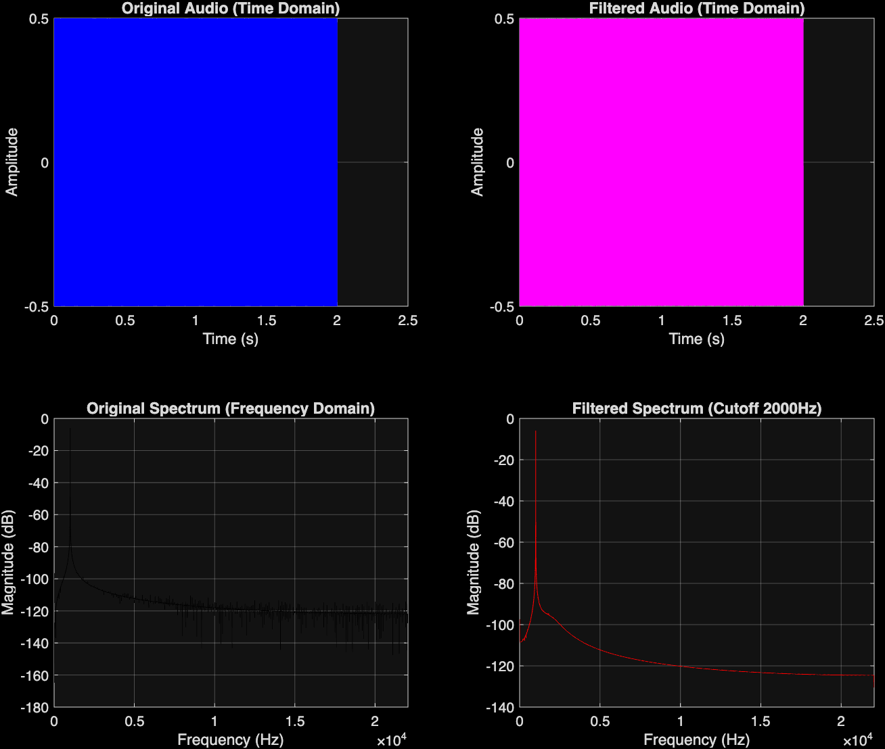

# 🎛️ MATLAB Audio Effects and Signal Processing


A professional, MATLAB-based audio processing tool designed for analyzing signals in the time and frequency domains, featuring customizable digital filters and effects.

## 📖 Overview

This project demonstrates core concepts of Digital Signal Processing (DSP) and Software Engineering applied in a MATLAB environment. It is structured to provide a clean, modular, and maintainable codebase for audio analysis and enhancement.

The primary script (`audio_processor.m`) handles:
1. **Signal Generation / Loading:** Capable of generating pure test tones (e.g., 1kHz sine wave) and simulating noisy environments, or loading pre-existing `.wav` files.
2. **Time Domain Analysis:** Plotting the raw and processed waveforms to visually inspect amplitude and time characteristics.
3. **Frequency Domain Analysis:** Leveraging the Fast Fourier Transform (FFT) to compute and display the single-sided amplitude spectrum, revealing the frequency components of the audio.
4. **Digital Filtering:** Applying high-quality digital filters to isolate or remove specific frequency bands.



## ⚙️ Engineering Highlights

*   **Zero-Phase Distortion Filtering:** The filtering module (`apply_digital_filter.m`) utilizes a **Butterworth filter** implemented via MATLAB's `filtfilt` function. By filtering the data in both the forward and reverse directions, it achieves zero-phase distortion, ensuring the filtered signal is not artificially delayed or shifted in time compared to the original.
*   **Modular Architecture:** The project separates source code (`src/`), data (`data/`), and output (`results/`), adopting best practices for code organization and scalability.
*   **Robust Data Handling:** Incorporates stereophonic to monophonic conversion strategies and dynamic signal parsing.

## 📁 Directory Structure

```text
matlab-audio-effects/
├── src/                # Core MATLAB scripts and functions
│   ├── audio_processor.m        # Main entry point for analysis
│   └── apply_digital_filter.m   # Digital filtering module
├── data/               # Input audio files (.wav, etc.)
├── results/            # Output directory for processed audio
├── tests/              # (Planned) Unit testing for DSP algorithms
├── docs/               # Documentation and visual assets
└── README.md           # Project documentation
```

## 🚀 How to Run

1. Clone the repository to your local machine:
   ```bash
   git clone https://github.com/leonardoalunno/matlab-audio-effects.git
   ```
2. Open MATLAB and navigate to the `src/` directory.
3. Execute the `audio_processor.m` script.
4. The script will automatically generate a noisy 1kHz test signal, apply a Low-Pass Butterworth filter, save the cleaned audio to the `results/` folder, and display a comprehensive 4-panel comparison figure.

## 👨‍💻 Author

**Leonardo Alunno**  
*Aspiring Computer Engineer*  
🔗 [LinkedIn](https://www.linkedin.com/in/leonardo-alunno-3095922b7)
